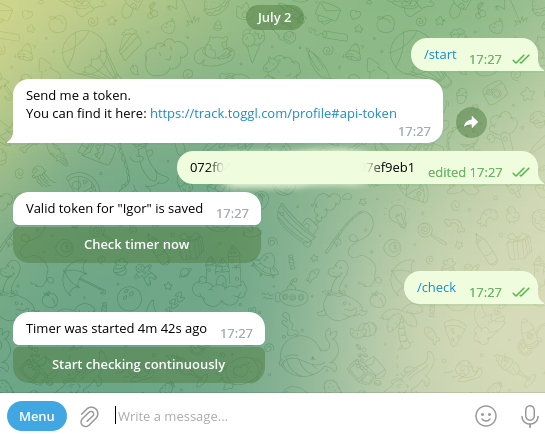

# @Toggl_status_bot - Telegram bot for checking Toggl Track timer status

[@Toggl_status_bot](https://t.me/Toggl_status_bot) is a Telegram bot designed to check the timer status
in [Toggl Track](https://track.toggl.com/), a popular time-tracking tool. Please note that the developer of this bot is
not affiliated with the Toggl company.

## About

This Node.js project utilizes the `telegraf` library to communicate with Telegram Bot API.

## Motivation

I created this bot because my wife uses Toggl Track for work, and I wanted a convenient way to know whether she's
currently busy or available. She has provided me with her API token, and I can check her timer status by sending a
command to the bot.

## Commands

* `/start` - start the bot and get information about the current status
* send a token to the bot, it will automatically identify and save to the database
* `/check` - perform a single timer status check
* use inline keyboard to initiate continuous checks
* `/stop` - stop current continuous status checks
* `/delete` - delete saved token from the database
* `/help` - display a list of available commands

## Demo

## Useful links

* [@BotFather](https://t.me/BotFather) - Telegram bot where you can register your own bot
* [Toggl Track profile](https://track.toggl.com/profile#api-token) page where you can find your API Token required for
  the bot to function.

## Disclaimer

The project is deployed on the developer's personal server, and every effort will be made to protect your API key from
being leaked. However, it cannot be guaranteed that such an event will never occur. Please use this bot at your own
risk.

Rest assured that the developer promises to never use your API keys for any purposes other than those described above.

## Note

This project was initially created to fulfill my own needs and practice using Node.js and telegraf. However, I have
decided to share it with the world.

If you are interested in improving the project, please feel free to contact me,
create a Pull Request, or open an issue. Thank you!

## Licence

MIT License
